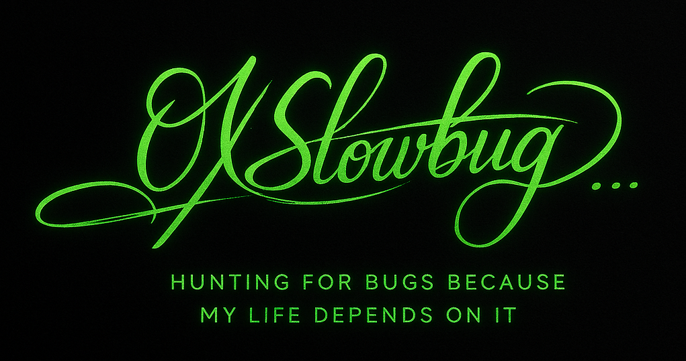

# 🧭 About Me
I am a smart contract auditor with experience across major web3 security platforms and real-world protocol reviews. I combine public contest performance with private-sector AI tooling experience.

* 🔍 **20+ public audit contests** on Sherlock, Code4rena, Cantina, and CodeHawks
* 🥇 **Multiple top-3 finishes** in competitive audits
* 🛡️ **Confirmed live bug bounty** on Immunefi
* 🧪 Currently an **Auditor at Quill Audits**, contributing to securing production-grade protocols
* ⚡ Focused on high-impact vulnerability discovery, DeFi security, gas optimizations, and clear remediation advice

### 🧩 Languages

* Solidity
* Move

### 💼 Areas of Expertise
I've audited projects in the following categories:

* Lending and Borrowing
* Synthetic tokens
* Vaults and Yield Aggregators
* AMMs (Automated Market Makers)
* Vesting
* Staking
* Launchpads

---

# Public Contests

You can view my full auditing portfolio on Sherlock here: [0xSlowbug](https://audits.sherlock.xyz/watson/0xSlowbug). I have achieved **2 first-place finishes**, **1 third-place finish**, and **6 top-10 results**, with **29+ medium/high severity findings** across competitions. I consistently deliver strong coverage and have fully identified all bugs in multiple contests. 

| 🛠️ Project        | 🔍 Category        | 🏆 Platform   | 🎖️ Placement | 📊 Findings | 🔗 Report |
|------------------|------------------|--------------|--------------|---------|---------|
| Usual ETH0       | Synthetic Token  | Sherlock     | 🥇 1st Place | 1M      | [Report](https://audits.sherlock.xyz/contests/988/report) |
| Neutrl Protocol  | Synthetic Dollar | Sherlock     | 🥇 1st Place | 1M      | [Report](https://audits.sherlock.xyz/contests/1065/report) |
| ThorWallet       | DeFi             | Code4rena    | 🥉 3rd Place | 1H      | [Report](https://audits.sherlock.xyz/contests/988/report) |
| 3jane       | Lending and Borrowing             | Sherlock    |  10th Place | 1M      | REDACTED |
| Virtuals Protocol | Launchpad            | Code4rena    | - | 4M      | [Report](https://code4rena.com/reports/2025-04-virtuals-protocol) |
| SecondSwap       | Launchpad             | Code4rena    | - | -      | [Report](https://code4rena.com/reports/2024-12-secondswap) |
| RAAC       | RWA             | Codehawks    | - | 8H, 6M, 2L      | [Report](https://codehawks.cyfrin.io/c/2025-02-raac) |
| Metropolis       | Vault             | Cantina    | - | 4M      | REDACTED |

---
# 🧪 Private Firm Experience 
## Quill AI

In addition to public contests, I bring practical private-sector experience from working with **Quill AI** as an **AI Tool Testing Intern**, contributing to the development and improvement of several production-grade security tools.

During this period, I:

* Tested **QuillShield AI** across diverse protocols, benchmarked its detection capabilities against auditors of different experience levels, and provided recommendations that shaped **QS v2 and v3**.
* Evaluated **QuillCheck**, an AI token scanner, ensuring its accuracy in detecting contract vulnerabilities, market risk patterns, honeypots, liquidity traps, and other token-level risks.
* Helped refine **WachAI Chat**, an AI chatbot for token scanning, and its **Twitter bot**, uncovering UX issues, logic inconsistencies, and accuracy gaps.
* Worked on the **WachAI Agent** (Virtuals ACP), testing its performance across:

  * ERC-4626 compliance checks
  * Token analysis and metadata accuracy
  * Audit reasoning and correctness
  * Prompt engineering and model guidance
  * Automation reliability across edge cases

These contributions directly improved the accuracy, robustness, and reasoning depth of the tools.

Say less 😄 here’s a **tight, clean, audit-focused** version:

---

## 🔍 Quill Audit

I worked with **Quill Audit** on multiple **private smart contract security reviews**, contributing to audits across **vaults, staking contracts, ERC-20/SPL tokens, and lending protocols**.

My work included:

* Reviewing contract logic and identifying **vulnerabilities, edge cases, and input validation issues**
* **Validating and reproducing findings**, assessing impact and exploitability
* Assisting with **audit report writing**, including root cause, impact, and remediation
* Reviewing tests and verifying fixes after mitigations

This role strengthened my ability to perform **practical, end-to-end smart contract audits**.

| 🛠️ Project | 🔍 Category   | 🧪 Audit Type | 🔗 Report   | 📅 Date |
| ----------- | ------------- | ------------- | ----------- | ------- |
| L.XYZ       | SPL Token     | Full Audit | [Report](#) | Dec 2024    |
| Krypc       | Vault         | Full Audit | [Report](#) | Dec 2024    |
| HoleInOne   | ERC-20 Token  | Full Audit | [Report](#) | Jan 2025    |
| PuffPaw     | Vault         | Full Audit | [Report](#) | Jan 2025    |
| Elsa        | Staking       | Full Audit | [Report](https://www.quillaudits.com/leaderboard/heyelsa-ai/heyelsa-staking) | Jan 2025    |
| NettyWorth  | Lending Vault | Quick Review | REDACTED | Jan 2025    |
| MDC Token   | ERC-20 Token  | Full Audit | [Report](#) | Jan 2025    |
| YODL        | Staking       | Full Audit | [Report](#) | Jan 2025    |

---

# 📬 Contact Info

If you're looking for a pragmatic, detail-oriented security researcher to review your protocol, feel free to send me a DM.

